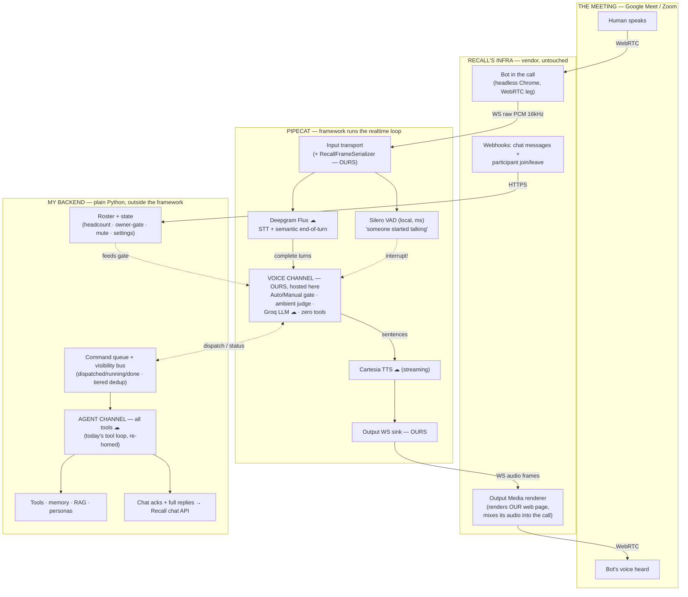

# Hybrid architecture — who owns what

One conversational turn through the hybrid design (Q1 decision). Boundaries = ownership. HTML/SVG version: `claude.ai/code/artifact/49ac712d-64e6-494d-8c4f-06ae1a16e55d`.

## Legend

| Marker | Meaning |
|---|---|
| MEETING | The call itself (Google Meet / Zoom) |
| RECALL | Vendor infra — untouched by us |
| PIPECAT | Framework — runs the realtime loop only |
| BACKEND | Ours — plain Python, outside the framework |
| "OURS, hosted here" | Our Python files that Pipecat merely schedules (serializer, voice-channel processor, output sink) |
| ☁ | External cloud service (Deepgram, Cartesia, Groq/OpenAI) |
| dashed arrows | Control/state signals (interrupt, gate inputs, queue/bus) — not audio |

## How to read it

- **Pipecat owns the loop, not the logic.** Its box is plumbing: moving audio frames, running VAD, calling Flux/Cartesia, killing TTS on barge-in. Zero product decisions live there.
- **Everything "OURS" is editable without touching the framework** — the gate, the channels, the tools, plus the thin web page Recall's Output Media renders (~100 lines: WS + audio element).
- **The agent channel never enters the framework.** Voice ↔ agent talk only through the queue/visibility bus. If Pipecat ever has to go, the blast radius is its box only.
- **WebRTC is entirely inside the meeting + Recall** — we never touch it. Our two hops (PCM in, audio frames out) are plain WebSockets.
