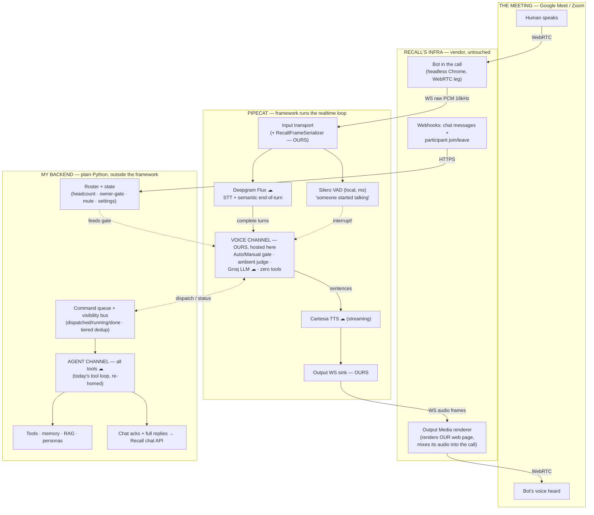

# Voice agent rebuild — master reference

Last updated: 2026-07-15 (Phase 1 review COMPLETE — next: the phase-wise build plan). This is the single source of truth for the real-time participant voice agent: what we're building, every decision made, the architecture, and the full keep/remove/change inventory. Sessions come and go; this document carries the state.

---

## 1. What we're building (the spec)

Today's live bot is **batch/turn-based**: Recall webhooks deliver transcript text → one fused gpt-4o-mini call picks tools AND writes the reply → TTS renders an MP3 → uploaded to Recall as a discrete blob. End-to-end ≈ 3–6s. It feels like a walkie-talkie.

The rebuild makes the bot a **real-time meeting participant** with a **dual-channel brain**:

- **Ears:** raw PCM audio (16kHz mono 16-bit LE) from Recall over WebSocket → Deepgram Flux (streaming STT + *semantic* end-of-turn detection) + Silero VAD (local, milliseconds, detects speech-*start* for barge-in).
- **Voice channel (talk brain):** tool-less, streaming LLM on Groq — replies begin while the human's turn is barely over. Owns the Auto/Manual engagement gate.
- **Agent channel (tool brain):** ALL tool calls (today's tool loop, re-homed). Commands queue; a visibility bus reports dispatched/running/done back to the voice channel, which narrates results. Chat message acks ("on it…") replace spoken filler.
- **Mouth:** streaming Cartesia TTS → a thin self-hosted web page ("rented speaker") that Recall's **Output Media** renders into the call. The MP3 path dies.
- **Target:** ~1.0–1.5s voice-to-voice. Latency instrumentation (t0 speech-end → t4 playout) is built in from day one; the only unmeasured unknown is Recall's Output-Media mix hop.

Inspiration: the Curio hackathon project (`C:\build\hackathons\Curio`) — Pipecat + Deepgram Flux + Cartesia. We reuse its components and patterns; see the hybrid decision below for what we take from Pipecat itself.

---

## 2. Core locked decisions

Made before the KRC review; do not reopen without cause.

| # | Decision | Choice |
|---|---|---|
| 1 | Product shape | Real-time meeting **participant**, not answer-only assistant |
| 2 | Vendor | **Keep Recall** (MeetingBaaS only if Recall's mix hop proves a hard ceiling) |
| 3 | Audio out | **Output Media** (thin hosted web page), MP3 blob path retired |
| 4 | Audio in | **Raw PCM + our own STT/endpointing** — not Recall's transcript (tunability) |
| 5 | Modes | **One pipeline**, a gating toggle — not two models |
| 6 | Ambient = participant | ambient / solo-freeflow / proactive collapse into ONE engagement gate |
| 7 | Web app | Thin "rented speaker" (~100 lines); the brain stays server-side Python |
| 8 | Latency levers | Hops are noise; the real lever is colocating backend near Recall's region |
| 9 | Phase 0 spike | **Cut.** Path is committed; hypothesized budget ~0.6–1.7s; the stopwatch ships inside Phase 2 instead ("kill the spike, keep the stopwatch") |

### Fork resolutions (all closed)

| Fork | Decision |
|---|---|
| ① Engagement style | **Two modes.** Auto = bot speaks directly (consent offer→"want it?"→deliver funnel is REMOVED). Manual = wake-word only. Mode never auto-switches; headcount is a signal *within* Auto. Auto is the default. |
| ② Talk-back scope | **Voice channel is tool-less.** ALL tools on the agent channel. Voice channel has full visibility (dispatched/running/done) via the bus and narrates results. |
| ③ Ack UX | **Silent voice + chat ack.** On dispatch, post "on it…" to meeting chat; no spoken filler. Tuning: ack slow tools (~>1.5s), skip instant ones. |
| ④ Endpointing | **Deepgram Flux + Silero VAD, simultaneously, different jobs.** Flux (cloud, semantic): "did they finish?" — end-of-turn, with eager-start/cancel events. Silero (local, ms): "did someone start talking over the bot?" — barge-in → instant shut-up. AssemblyAI = named fallback. Pre-build check: Flux enabled on the Deepgram key. |
| ⑤ STT + TTS | STT = Deepgram (Flux IS the STT — one model, one socket). **TTS = Cartesia, locked.** Future: emotion/expressiveness (Cartesia per-utterance controls). |

### The hybrid framework decision (Q1)

**Pipecat runs the realtime audio loop; the agent channel stays entirely outside it.**

- Pipecat (violet in the graph): input transport, Silero interruption, Flux service, Cartesia service, output sink, TTS-kill on barge-in. Pre-debugged plumbing — minimizes live-meeting debug iterations, which are the scarce resource.
- Our code hosted *inside* Pipecat as custom pieces: `RecallFrameSerializer` (PCM in), the **voice-channel processor** (talk brain + Auto/Manual gate + ambient judge), the output WS sink.
- **The agent channel never enters the framework** — plain Python like today's tool loop, bridged by the command queue + visibility bus. If Pipecat ever has to go, the blast radius is the audio loop only.
- Rationale: build time is the agent's cost, not the user's; the currency is live-meeting debug iterations (worst for hand-rolled realtime concurrency). The customizability that matters (gate, channels, personas, tools) lives in our code either way. Framework-docs staleness is mitigated by the context7 MCP (live docs).

---

## 3. Architecture — who owns what

(HTML version with the same content: the "Who owns what" artifact.)

Key readings: Pipecat owns the *loop*, not the *logic* — zero product decisions live in the violet box. The voice↔agent bridge is only the queue/bus. The web page Output Media renders is ours (~100 lines: WS + audio element).

---

## 4. KRC inventory — realtime_routes.py (~3,600 lines)

Verdicts: **keep** = survives (may re-home) · **change** = concept survives, reworked · **replace** = new component takes the job · **remove** = deleted outright.
Status: ✓ = approved by owner · ⏳ = awaiting ruling.

### A · Ingress (ears today)

| # | Piece | Verdict | Status | Notes |
|---|---|---|---|---|
| 1 | Webhook endpoints + token auth | change | ✓ | Door stays for chat + participant events; stops receiving speech (Q2 ✓) |
| 2 | Utterance accumulator + plumbing | replace | ✓ | Flux does this semantically; A/B compare + legacy simulation scaffolding deleted |
| 3 | Pre-perception observability | remove | ✓ | Measures the retiring webhook transport; PCM path gets simpler counters |
| 4 | Ingress rate limiter | change | ✓ | Webhook event cap → WS connection sanity + socket limits |
| 5 | Participant roster + speaker hygiene | keep | ✓ | Headcount, bot-self detection, name scrubbing — feeds the gate |

### B · Wake & engagement gating

| # | Piece | Verdict | Status | Notes |
|---|---|---|---|---|
| 6 | Wake-word machinery | change | ✓ | Manual mode's trigger. 8s pending window: fragment-gluing half dies with Flux; "name, pause, then ask" pattern survives |
| 7 | Solo free-flow | change | ✓ | Becomes a headcount signal *inside* Auto (1 human → converse freely). Never switches modes; Manual stays strict |
| 8 | Ambient loop (consent funnel) | change | ✓ | "Want it?" middleman dies; the judge delivers directly |
| 9 | Proactive checker + idea generation | change | ✓ | Demoted to *proposers* feeding the Auto gate — only the gate speaks |
| 10 | Command debounce → **command queue** | replace | ✓ | Owner's redesign: 3s blind window dies. Commands queue on the agent channel; tiered dedup (string similarity free tier → small fast model for ambiguous "same command vs new command, same tool") |
| 11 | Mode + mute endpoints | keep | ✓ | /mode becomes the Auto↔Manual toggle surface; /mute stays kill-switch |

### C · The brain

| # | Piece | Verdict | Status | Notes |
|---|---|---|---|---|
| 12 | `_process_command` (640-line core) | change | ✓ | Split into the two channels; pieces re-home per rows below |
| 13 | Prompt assembly + injection guard | change | ✓ | **Care required:** every prompt feature (static prefix, recent-turn shaping, utterance wrapping, owner email) gets an explicit documented home — voice, agent, or deliberately both. No feature silently dropped, no ambiguity about which channel gets what. Dissection happens in the build plan |
| 14 | Tool-call recovery + leak scrubbing | keep | ✓ | Recovery → agent channel; delta leak-scanner → voice channel |
| 15 | Capability-block memory | keep | ✓ | Agent channel; bus surfaces blocks so the voice can say "Gmail's not connected" |
| 16 | Owner-gate + owner-id lock | keep | ✓ | Safety-critical, untouched, re-homed |
| 17 | Stand-in spoken updates | keep | ✓ | Deterministic pre-LLM fast path on the voice channel |
| 18 | Three-layer live memory | keep | ✓ | Transport-independent; both channels read it |

**Q4 ✓ decided:** voice channel runs on **Groq** (tool-less conversational speed; provider already in the stack); agent channel stays gpt-4o-mini (battle-tested tool-calling). If Groq misbehaves, owner flags it and we revisit.

### D · The mouth

| # | Piece | Verdict | Status | Notes |
|---|---|---|---|---|
| 19 | MP3 upload path + playback pacing | remove | ✓ | Q5 ✓: delete outright in Phase 2 — git/branch is the fallback, no flag |
| 20 | Streaming voice groundwork | change | ✓ | Re-target MP3→Output-Media WS **faithfully**: keep every non-redundant feature, change destination not skeleton behavior |
| 21 | Speak-short / chat-full | keep | ✓ | Spoken copy condensed, full text to chat — unchanged |
| 22 | Politeness gate + barge-in | change | ✓ | Re-implement on real audio (Silero speech-start, PCM silence). Current: 1.2s transcript-silence, 4.0s cap, 200ms poll — knobs carry over; report observed timings post-rebuild |
| 23 | Chat responder | keep | ✓ | More central now: ack surface + full-reply surface |

### E · Side surfaces & lifecycle

| # | Piece | Verdict | Status | Notes |
|---|---|---|---|---|
| 24 | Transcript recording | keep | ✓ | Human speech source becomes Flux; bot lines + chat lines unchanged |
| 25 | Live catch-up ("Ask Prism, just you") | keep | ✓ | Untouched |
| 26 | Settings + persona cache | keep | ✓ | The gate reads the same settings |
| 27 | Bot state lifecycle | change | ✓ | State dict restructured deliberately (accumulator fields out; Flux session + channel/bus state in) |
| 28 | Experiment feature flags | remove | ✓ | Q6 ✓: per-phase demolition; keep only operational switches |

All questions decided: Q1 hybrid · Q2 webhooks stay · Q3 reuse judge · Q4 Groq voice channel · Q5 delete MP3 outright (branch = fallback) · Q6 per-phase flag demolition.

---

## 5. Additional decisions & session notes

- **Build workflow is continuous, not test-gated.** After the review completes, a detailed multi-part, phase-wise build plan gets written. Then phases execute back-to-back: agent implements phase N, owner feeds it phase N+1 (fixing errors as they surface). Real testing happens on the **whole thing** at the end — there is no meaningful mid-way test point. The owner reviews plans, not intermediate builds.
- **Phases (post-review):** 2 = transport swap (+ latency stopwatch t0→t4 baked in) · 3 = two-channel split (+ queue/bus + chat acks) · 4 = Auto/Manual gate unification · 5 = feel tuning (barge-in, gaps, voice — Curio `tuning.py` knobs).
- **WebSocket vs WebRTC:** WebRTC lives inside the meeting and inside Recall; we never touch it. Our two hops (PCM in, audio out) are WebSockets — TCP, fine on the clean backend↔Recall datacenter link.
- **Latency budget (hypothesized, replaces the cut spike):** STT/endpoint 150–400ms · LLM first token 200–500ms · TTS first audio 100–300ms · Recall Output-Media mix hop = the one unknown (guess 100–500ms). Total ~0.6–1.7s. The t3→t4 (mix hop) number must be surfaced loudly in Phase 2 — it's the number that would send us to MeetingBaaS.
- **Chat-ack threshold:** ack tools not done in ~1.5s; skip sub-second lookups (avoid chat spam). Tunable.
- **Voice channel reads results, never calls tools** — even quick knowledge lookups pay the agent-channel round trip; the bus makes the voice channel informed rather than amnesiac.
- **Persona wake-words carry over:** per-persona bot names (Flash, Echo, …) remain the Manual-mode triggers.
- **Reference artifacts (this session set):** build plan (`claude.ai/code/artifact/e302727e…`), ownership graph (`…/49ac712d…`), KRC review (`…/80e5d0e6…`), session response log (`…/d4d446db…`), architecture explainer (`…/6c1be0bc…`), original research memo (`…/aa9b2f4b…`).
- **Future ideas ledger:** `docs/future-ideas.md` — expressive TTS, engagement-style revisit, "should I speak" judge tuning/redesign, in-house Recall replacement.

---

## 6. Current status

- **Phase 1 (KRC review) COMPLETE (2026-07-15):** all 28 items approved, all 6 questions decided.
- **Build plan written (2026-07-15):** [overview](voice-agent-build-plan-overview.md) · [phase 2](voice-agent-build-plan-phase2.md) · [phase 3](voice-agent-build-plan-phase3.md) · [phase 4](voice-agent-build-plan-phase4.md) · [phase 5](voice-agent-build-plan-phase5.md).
- **Phase 3 dry build COMPLETE — additive, behind `PRISM_TWO_CHANNEL` (2026-07-18):** the two-channel brain is built alongside the fused `_process_command`, NOT in place of it. **Demolition-vs-wait resolved → WAIT:** the new modules are transport-independent (agent channel is plain Python; voice channel is LLM streaming — neither depends on the unmeasured t3→t4 mix-hop), so they went in additively; `_process_command` / `bridge.py` / MP3 stay as the live fallback until one real meeting validates the split (then flip the default + demolish). **Groq re-added (owner call, "follow plan fully"):** it had been removed 2026-06-14 (`bef49a3`) because its free-tier 100k-tok/day cap turned the (since-fixed) runaway-analysis bug into an outage — the master's "provider already in the stack" premise was a month stale. Re-added scoped to the voice channel only (tool-less, low volume); `get_groq()` in `clients.py` degrades to `None`→gpt-4o-mini when `GROQ_API_KEY`/the `groq` package is absent, so nothing crashes without it. New: `backend/voice/{prompts,bus,agent_channel,voice_channel}.py`. `prompts.py` = the dissection table (§3) realized — voice prefix (tool-less, dispatch-or-talk) fresh; agent prefix reuses realtime's tuned gmail/calendar/tool-policy text. `bus.py` = per-bot queue + tiered dedup (difflib ≥0.85 tier-1 drop; 0.60–0.85 → Groq-8B yes/no; replaces the 3s blind debounce, item 10). `agent_channel.py` = `_process_command`'s tool loop re-homed (owner-gate + capability-block + recovery + taint-strip + verb-gate + haiku fallback), emits bus status, returns the result. `voice_channel.py` = stand-in fast path + streaming Groq talk-vs-`ACT`-dispatch + chat ack (1.5s, item 23) + narration; registered as the bus handler. Dispatch sites (`_dispatch_command`, chat-command path) route to the bus when the flag is on; `cleanup_bot_state` clears the bus. **Verified:** all modules import clean; bus dedup + dispatch-parse self-checks pass; end-to-end smoke (fake Groq stream) exercises both talk + dispatch paths incl. bus status events. **NOT run in a real meeting** — same key-stop as Phase 2. **Deferred to demolition (post live-test):** delete `_process_command`/`_dispatch_command`/`bridge.py`/`_COMMAND_DEBOUNCE_S`; make voice_channel a true Pipecat processor (frame-level, needed for Phase-5 barge-in); full t0–t4 stopwatch threading. Plan: [phase 3](voice-agent-build-plan-phase3.md).
- **Phase 2 dry build COMPLETE — AT THE KEY STOP (2026-07-18):** branch fast-forwarded to `main` (`5a6f834`, ~90 commits; the Flux/keyterm question resolved — Flux supports keyterm prompting, so main's `custom_keyterms` grounding carries over). `backend/voice/` complete: `serializer` (Recall→Flux frames), `pipeline` (split-socket: Recall audio-in transport + Cartesia→speaker-page sink), `audio_routes` (2 WS + speaker page), `speaker_page`, `bridge` (Flux EndOfTurn → existing `_handle_realtime_payload`, brain untouched), `stopwatch` (t0–t4). Bot-create payload re-targeted (audio WS + `output_media` webpage + dropped `transcript.data`). Router registered; `pipecat-ai[deepgram,cartesia,silero]==1.4.0` added. All modules import-clean against pipecat 1.4.0; serializer + stopwatch self-checks pass. **Verified vs live docs (pipecat 1.4.0 in Curio venv, Recall API):** all ⚠ field names. **Deferred to live wiring (post-keys):** the mouth re-point in `realtime_routes` (reply emission → `bridge.speak`) + Phase-2 demolition commit (MP3 path / accumulator / perception_state / transcript.data branch). Next: owner supplies keys (overview §"key stop") → resume with first live join + t3→t4 readout.
